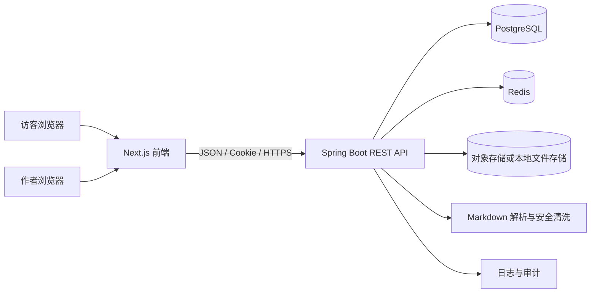

# 个人博客架构设计与技术选型

## 1. 设计目标

### 1.1 产品目标

构建一个支持在线 Markdown 写作、草稿自动保存、文章发布、公开阅读、Markdown 导入和文章导出的个人博客。

### 1.2 工程目标

- 前后端完全分离，前端和后端通过稳定的 REST API 通信。
- 后端采用模块化单体，便于学习 Java 和 Spring，也保留后续拆分空间。
- Markdown 原文作为内容事实来源，渲染结果可重新生成。
- 文章状态、权限、发布和导入导出规则由后端统一控制。
- 首期可在本地和单台云服务器部署，不引入不必要的分布式复杂度。
- 关键业务有自动化测试，文章内容和数据库有备份策略。

### 1.3 非目标

- 首期不做微服务、多人实时协同、复杂评论系统和付费体系。
- 首期引入 Redis，但只承担 Session、缓存、计数和限流等明确职责；不把 Redis 当作文章主数据库。
- 首期不引入消息队列和 Elasticsearch，除非实际性能或搜索需求证明需要。
- 前端页面开发不作为 Java 学习内容；前端由已有前端经验的开发者使用成熟技术完成。

## 2. 总体架构

### 2.1 架构形态

采用“独立前端 + REST API + 模块化单体后端 + 关系数据库”的架构。



### 2.2 部署架构

开发环境：

```text
Next.js dev server :3000
        |
Spring Boot API :8080
        |
PostgreSQL :5432
        |
Redis :6379
        |
MinIO :9000 / 本地 uploads 目录
```

生产环境：

```text
Internet
   |
HTTPS 反向代理（Nginx/Caddy）
   |------------------------------|
   v                              v
Next.js 容器                    Spring Boot 容器
                                      |
                              PostgreSQL 容器/托管数据库
                                      |
                                     Redis
                                      |
                              S3/MinIO 对象存储
```

生产环境建议：

- 公开站点和 API 使用 HTTPS。
- 反向代理负责 TLS、域名、压缩和基础安全响应头。
- API 不直接暴露数据库端口。
- PostgreSQL 数据和媒体文件使用持久化卷或托管服务。
- 应用、数据库、对象存储分别配置备份和恢复方式。

## 3. 技术选型

### 3.1 技术栈总表

| 层级 | 选型 | 说明 |
| --- | --- | --- |
| 前端框架 | Next.js + React + TypeScript | 主流 React 框架；公开文章可使用 SSR/缓存，有利于 SEO |
| 前端请求 | 原生 Fetch 或现有团队请求库 | 由前端按习惯选择，不作为 Java 学习内容 |
| 后端语言 | Java 21 LTS | 稳定长期支持版本，学习现代 Java |
| 后端框架 | Spring Boot 3.x | Web、配置、测试和生态完整 |
| Web 层 | Spring MVC | 实现 REST API、参数绑定和异常处理 |
| 安全 | Spring Security + HttpOnly Cookie Session | 首期实现简单、可靠；避免过早引入 JWT 复杂度 |
| 数据库 | PostgreSQL | 支持关系约束、事务、全文检索和 JSON 字段 |
| 缓存与临时数据 | Redis | Session、文章缓存、阅读数、限流；不保存唯一业务数据 |
| 数据访问 | Spring Data JPA + Hibernate | 快速完成业务；复杂查询补充 JPQL/SQL |
| 数据库迁移 | Flyway | 让表结构变更可审计、可重复部署 |
| Markdown | CommonMark/GFM 兼容 Java 库 | 服务端统一解析，确保预览和公开内容一致 |
| HTML 清洗 | 白名单 Sanitizer | 防止 Markdown 中的 XSS 和危险链接 |
| 文件存储 | S3 兼容对象存储；本地开发用 MinIO | 图片和导入资源不直接存数据库 |
| 测试 | JUnit 5、Mockito、MockMvc、Testcontainers | 覆盖单元、接口和真实数据库集成测试 |
| 构建 | Maven | 依赖、编译、测试和打包统一 |
| 部署 | Docker Compose | 适合个人项目和单机部署 |
| 反向代理 | Caddy 或 Nginx | HTTPS、域名和请求转发 |

### 3.2 关键选型理由

#### 为什么选择 Next.js

博客公开内容需要 SEO 和稳定的首屏展示。Next.js 可以让公开文章页面使用服务端渲染或静态生成，管理端仍然可以按客户端交互方式工作。它保持 React 生态，同时比纯 SPA 更适合公开内容站点。

#### 为什么选择模块化单体

当前只有一个博客作者和一个主要业务域，微服务不能带来相应收益，却会增加部署、调用、事务和排查成本。模块化单体能让代码边界清楚，同时保留未来拆分的可能。

#### 为什么首期使用 Session 而不是 JWT

博客后台的认证需求不复杂。HttpOnly Cookie Session 可以避免在浏览器存储 Token，减少 Token 刷新、撤销和泄露处理问题。前后端分离并不等于必须使用 JWT；只要正确配置 CORS、Cookie 和 CSRF，Session 同样适用。

#### 为什么加入 Redis，但不让 Redis 取代 PostgreSQL

Redis 在这个项目中有明确的学习和业务用途：保存登录 Session、缓存公开文章详情、承接阅读数增量和执行登录/上传限流。它是共享的服务端内存数据存储，不是前端本地缓存，也不是文章的最终数据源。

文章正文、用户和发布状态仍然以 PostgreSQL 为准。Redis 缓存必须设置过期时间，并在文章更新、发布和下线时主动失效；Redis 不可用时，核心文章读写不能因此丢失或破坏。

#### 为什么首期不用 Elasticsearch

文章量较小，PostgreSQL 足以完成分页、筛选和基础搜索。先通过数据库索引和 PostgreSQL 全文检索解决实际问题；当出现明确的搜索相关性、分词或性能需求时再引入 Elasticsearch。

## 4. 后端模块设计

后端按业务能力组织，而不是按所有 Controller、Service、Repository 全局分包。

```text
com.example.blog
├── common          公共响应、异常、配置、日志、分页
├── cache           Redis 连接、缓存键、TTL 和失效策略
├── auth            登录、退出、当前用户、权限
├── post            文章、草稿、发布、版本、回收站
├── taxonomy        分类、标签
├── media           图片上传、资源元数据、存储适配
├── markdown        Markdown 解析、清洗、目录、导入导出
├── site            站点设置、作者信息、SEO 默认配置
└── analytics       阅读数和基础访问统计
```

### 4.1 模块职责

| 模块 | 负责 | 不负责 |
| --- | --- | --- |
| auth | 认证、会话、权限判断 | 文章业务 |
| post | 文章生命周期、状态、版本 | Markdown 底层解析 |
| markdown | 解析、清洗、Front Matter、导出 | 决定文章是否可发布 |
| media | 文件校验、存储、资源 URL | 文章正文业务 |
| taxonomy | 分类、标签和关联关系 | 文章发布状态 |
| site | 博客名称、作者资料、默认 SEO | 用户登录 |
| analytics | 阅读数和访问事件 | 文章内容修改 |

### 4.2 分层职责

```text
Controller      接收 HTTP 请求，校验输入，转换响应
Application     编排一个完整用例，控制事务边界
Domain/Service  执行业务规则和状态转换
Repository      持久化抽象和查询
Entity          数据库映射，不作为 API 响应直接暴露
DTO             API 请求和响应模型
Infrastructure  文件存储、Markdown 库、外部服务适配
```

建议首期不强行搭建复杂 DDD 层级，但必须遵守：

- Controller 不写业务规则。
- Entity 不直接作为 API 返回对象。
- Service 不依赖前端页面。
- Repository 不决定发布权限。
- 文件存储和 Markdown 库通过接口隔离，便于替换。

## 5. 前后端接口设计

### 5.1 API 规则

- 基础路径：`/api`。
- 公共内容：`/api/public/**`。
- 认证：`/api/auth/**`。
- 管理操作：`/api/admin/**`。
- 请求和响应默认使用 JSON；文件上传使用 `multipart/form-data`。
- 时间统一使用 ISO 8601，服务端保存 UTC，展示时由前端按站点时区格式化。
- 列表接口统一分页、排序和筛选参数。
- 资源创建返回 201，删除或状态操作使用明确的 200/204。

### 5.2 核心接口

| 方法 | 路径 | 用途 |
| --- | --- | --- |
| POST | `/api/auth/login` | 作者登录，写入 HttpOnly Session Cookie |
| POST | `/api/auth/logout` | 作者退出 |
| GET | `/api/auth/me` | 获取当前登录用户 |
| GET | `/api/public/posts` | 获取公开文章列表 |
| GET | `/api/public/posts/{slug}` | 获取公开文章详情 |
| GET | `/api/public/categories/{slug}/posts` | 获取分类文章 |
| GET | `/api/public/tags/{slug}/posts` | 获取标签文章 |
| GET | `/api/public/search?q=` | 搜索公开文章 |
| GET | `/api/admin/posts` | 管理端文章列表 |
| POST | `/api/admin/posts` | 创建草稿 |
| GET | `/api/admin/posts/{id}` | 获取编辑数据 |
| PATCH | `/api/admin/posts/{id}` | 保存文章修改 |
| POST | `/api/admin/posts/{id}/preview` | 预览 Markdown |
| POST | `/api/admin/posts/{id}/publish` | 发布或更新发布 |
| POST | `/api/admin/posts/{id}/unpublish` | 下线文章 |
| POST | `/api/admin/imports/markdown` | 导入 Markdown 文件 |
| GET | `/api/admin/posts/{id}/export` | 导出单篇 Markdown |
| POST | `/api/admin/media` | 上传图片 |

### 5.3 统一响应示例

成功响应：

```json
{
  "data": {
    "id": "post_123",
    "title": "我的第一篇文章",
    "slug": "my-first-post",
    "status": "DRAFT",
    "version": 3
  },
  "requestId": "req_abc"
}
```

错误响应：

```json
{
  "code": "POST_SLUG_CONFLICT",
  "message": "文章链接已存在",
  "fieldErrors": {
    "slug": "请更换一个 slug"
  },
  "requestId": "req_abc"
}
```

### 5.4 版本冲突

编辑接口携带当前版本号：

```json
{
  "title": "更新后的标题",
  "markdownContent": "# 正文",
  "version": 3
}
```

如果数据库当前版本不是 3，后端返回 409 `POST_VERSION_CONFLICT`，不覆盖服务端数据。前端可以提示用户重新加载、覆盖或复制本地内容。

## 6. 认证、权限与安全

### 6.1 认证方案

采用 Spring Security Session：

1. 前端提交账号密码到 `/api/auth/login`。
2. 后端验证密码哈希。
3. 登录成功后写入 HttpOnly Session Cookie。
4. 前端后续请求携带 `credentials: include`。
5. 后端从 Session 读取当前用户，不信任前端传入的用户 ID。
6. 退出时使 Session 失效。

### 6.2 Cookie 与跨域

- 生产环境启用 `Secure`。
- Cookie 设置 `HttpOnly`，前端 JavaScript 不直接读取会话值。
- 根据前后端域名关系配置 `SameSite`。
- CORS 只允许明确的前端 Origin，不允许生产环境使用 `*`。
- 修改数据的请求启用 CSRF 防护，前端按约定携带 CSRF Token。

### 6.3 权限矩阵

| 操作 | 匿名访客 | 作者 |
| --- | --- | --- |
| 查看已发布公开文章 | 允许 | 允许 |
| 搜索公开文章 | 允许 | 允许 |
| 查看草稿 | 禁止 | 允许 |
| 创建、编辑文章 | 禁止 | 允许 |
| 发布、下线文章 | 禁止 | 允许 |
| 导入和导出 | 禁止 | 允许 |
| 修改站点设置 | 禁止 | 允许 |

### 6.4 Redis 使用边界

| 用途 | Redis 数据 | 一致性要求 | 失效/恢复策略 |
| --- | --- | --- | --- |
| 登录 Session | Session 数据 | 登录态可用 | Redis 重启后要求重新登录或从持久化恢复 |
| 文章详情缓存 | 已发布文章展示数据 | PostgreSQL 为准 | 发布、更新、下线时删除对应缓存；设置 TTL |
| 阅读数 | 短期增量计数 | 允许短暂延迟 | 定时或按批次写回 PostgreSQL |
| 登录限流 | 用户/IP 次数和过期时间 | 允许偶发误差 | TTL 自动过期，Redis 不可用时使用保守限流策略 |

不缓存草稿写入，不把 Redis 中的数据作为文章恢复的唯一来源，也不在业务代码中散落 Redis key 字符串。所有 key 和 TTL 通过 `cache` 模块集中管理。

## 7. 数据库设计

### 7.1 核心表

| 表 | 关键字段 | 说明 |
| --- | --- | --- |
| `users` | `id`, `email`, `password_hash`, `role` | 作者账号 |
| `posts` | `id`, `author_id`, `title`, `slug`, `markdown_content`, `status` | 文章当前内容 |
| `post_versions` | `post_id`, `version_number`, `markdown_content` | 版本快照 |
| `categories` | `id`, `name`, `slug` | 分类 |
| `tags` | `id`, `name`, `slug` | 标签 |
| `post_tags` | `post_id`, `tag_id` | 文章标签关联 |
| `media` | `id`, `storage_key`, `url`, `mime_type`, `size` | 图片和资源 |
| `site_settings` | `key`, `value` | 站点配置 |
| `audit_logs` | `actor_id`, `action`, `target_id`, `created_at` | 关键操作日志 |

### 7.2 约束与索引

- `posts.slug` 在未删除文章范围内唯一。
- `categories.slug` 和 `tags.slug` 唯一。
- `posts.author_id`、`posts.status`、`posts.published_at` 建立组合查询所需索引。
- 公开列表索引优先覆盖 `status = PUBLISHED` 和 `published_at`。
- 搜索首期使用 PostgreSQL `ILIKE` 或全文检索；发布后根据数据量再优化。
- 所有时间字段保存 UTC。
- 文章删除使用 `deleted_at` 软删除。

### 7.3 文章状态

```text
草稿 -> 已发布
已发布 -> 已发布（更新版本）
已发布 -> 已下线
草稿/已下线 -> 回收站
回收站 -> 草稿或已下线
```

状态转换必须通过 `PostService`，不能由 Controller 或前端直接修改状态字段。

## 8. Markdown 与文件处理

### 8.1 Markdown 处理链

```text
Markdown 原文
    -> 解析 AST/HTML
    -> 白名单清洗
    -> 代码高亮和目录提取
    -> 安全 HTML 响应
    -> 公开端渲染
```

### 8.2 导入流程

1. 校验扩展名、MIME、大小和 UTF-8 编码。
2. 解析 YAML Front Matter。
3. 将元数据映射为文章字段。
4. 创建草稿，不允许通过文件内容绕过发布流程。
5. 保存原始 Markdown 和导入日志。
6. 返回草稿 ID、解析警告和字段回填结果。

### 8.3 导出流程

1. 校验作者权限。
2. 读取文章最新已保存版本。
3. 生成 Front Matter 和 Markdown 正文。
4. 设置 `Content-Type: text/markdown; charset=UTF-8`。
5. 设置安全的 `Content-Disposition` 文件名。
6. 以流方式返回文件，避免不必要的临时文件。

### 8.4 图片存储

- 数据库只保存存储键、访问 URL、MIME、大小和尺寸等元数据。
- 文件名不直接作为服务器路径，使用随机 ID 或哈希作为存储键。
- 图片上传接口限制格式和大小，并拒绝可执行文件。
- 本地使用 MinIO 或固定 uploads 目录，生产切换 S3 兼容对象存储。
- 通过 `StorageService` 接口隔离本地存储和对象存储实现。

## 9. 非功能设计

### 性能

- 公开文章详情优先使用 Next.js SSR 和 HTTP 缓存。
- 后端列表接口必须分页，默认每页 10-20 条。
- 图片懒加载和尺寸限制由前端负责，文件大小和格式由后端强制校验。
- 公开读接口目标 P95 小于 500 ms；保存接口目标 P95 小于 1 秒。

### 可用性

- 自动保存失败不能导致服务端覆盖新内容。
- API 返回明确加载、空结果、错误和冲突状态。
- 文章发布、导入、导出和上传失败都可重试。

### 安全

- 密码只保存哈希值。
- Markdown、HTML、URL、文件名和 Front Matter 均进行服务端校验。
- 管理接口统一鉴权和审计。
- 生产环境关闭调试信息，日志不记录密码、Cookie 和完整敏感正文。

### 可观测性

- 使用结构化日志记录请求方法、路径、状态码、耗时和 request ID。
- 记录登录、发布、下线、导入、导出和删除等审计事件。
- 提供 `/api/health`，后续增加数据库连接检查和 `/api/ready`。

## 10. 开发计划

按每周 10-12 小时投入，预计 16 周完成可部署 MVP。前端不安排学习任务，但在每个接口迭代完成后进行联调。

### 第 1 周：仓库和基础设施

学习与设计：

- Java 21、Maven、Spring Boot 启动流程。
- REST API、HTTP 状态码和 JSON 序列化。
- Git 分支和提交规范。

开发交付：

- 初始化 `backend` 和 `frontend` 两个独立目录。
- Spring Boot `/api/health`。
- 基础配置、环境变量和 README。
- Docker Compose 启动 PostgreSQL。
- Docker Compose 启动 Redis，并完成 Spring Boot Redis 连接检查。

验收：后端能启动，测试能运行，数据库能连接，前端可调用健康接口。

### 第 2 周：Java 领域基础与文章内存模型

学习与设计：

- 类、接口、枚举、集合、异常和时间类型。
- 文章状态机和 Repository 抽象。

开发交付：

- 完成 `Post`、状态枚举和 slug 规则。
- 实现内存版文章服务。
- 为创建、查询、状态转换和 slug 冲突写单元测试。

验收：业务逻辑不依赖 Spring，可以单独测试。

### 第 3 周：REST API 入门

学习与设计：

- Controller、DTO、JSON、分页和接口错误。

开发交付：

- `GET /api/public/posts`。
- `GET /api/public/posts/{slug}`。
- `POST /api/admin/posts`。
- `PATCH /api/admin/posts/{id}`。
- 统一响应和 request ID。

验收：用 curl 或现有前端请求工具完成文章创建和查询联调。

### 第 4-5 周：数据库与持久化

学习与设计：

- SQL、主键、唯一约束、索引、事务和 ORM。
- Flyway migration 和 Entity/DTO 分离。

开发交付：

- 创建 users、posts、post_versions、categories、tags 等表。
- 用 PostgreSQL 替换内存存储。
- 完成分页、软删除和 slug 唯一约束。

验收：删库后可通过 migration 重建，文章 CRUD 和分页测试通过。

### 第 6 周：参数校验和统一异常

学习与设计：

- Bean Validation、`@ControllerAdvice` 和 HTTP 错误语义。

开发交付：

- 标题、正文、slug、分页和筛选参数校验。
- 统一 400、404、409、500 响应。
- 完善 API 文档和错误码。

验收：非法请求不会进入业务层，前端能定位字段错误。

### 第 7-8 周：Markdown 服务和自动保存

学习与设计：

- Markdown AST/HTML、XSS、白名单清洗。
- 自动保存、幂等和乐观锁。

开发交付：

- Markdown 预览 API。
- 草稿保存 API。
- 版本号冲突检测。
- 目录、代码高亮和阅读时长数据。

验收：恶意 HTML 不执行，两个客户端同时编辑时返回 409。

### 第 9 周：认证、Redis Session 和权限

学习与设计：

- Spring Security Filter Chain、Session、Cookie、CORS 和 CSRF。

开发交付：

- 登录、退出、当前用户接口。
- 管理 API 鉴权。
- 公开内容和草稿的权限隔离。
- HttpOnly Cookie 本地跨端口联调。
- 使用 Redis 保存 Session，配置 Session TTL 和退出失效。
- 增加登录失败限流。

验收：未登录返回 401，越权访问返回 403，Cookie 和 CSRF 配置生效；Redis 重启后系统行为符合预期，不会造成文章数据丢失。

### 第 10 周：发布、公开内容 API 和文章缓存

学习与设计：

- 状态机、发布版本、缓存和公开数据投影。

开发交付：

- 发布、更新发布、下线、恢复。
- 公开首页、详情、归档、分类和标签 API。
- SEO 和分享元数据字段。
- 缓存已发布文章详情，发布、更新发布和下线时主动失效。

验收：草稿修改不影响线上版本，下线文章不出现在公开接口；缓存失效后能读取最新文章。

### 第 11 周：搜索、分类和标签

学习与设计：

- 多表查询、分页排序和 PostgreSQL 搜索。

开发交付：

- 分类、标签 CRUD。
- 公开搜索接口。
- 搜索索引和无结果处理。

验收：公开搜索只返回已发布文章，分页和特殊字符测试通过。

### 第 12 周：图片上传与 Markdown 导入

学习与设计：

- Multipart 文件上传、流、MIME 和对象存储抽象。
- YAML Front Matter 映射和容错。

开发交付：

- 图片上传 API。
- Markdown 导入 API。
- 导入元数据回填和警告列表。
- 文件安全校验。

验收：合法文件进入草稿，异常文件不会覆盖数据或导致服务崩溃。

### 第 13 周：文章导出与版本能力

开发交付：

- 单篇 Markdown 导出。
- Front Matter 生成。
- 导出后重新导入的 round-trip 测试。
- 文章版本查询和恢复接口作为可选增强。

验收：导出文件为 UTF-8，正文和主要元数据可恢复。

### 第 14 周：测试补全与重构

开发交付：

- Service 单元测试。
- MockMvc API 测试。
- Testcontainers PostgreSQL 集成测试。
- 登录、发布、冲突、导入、导出和上传异常测试。
- 清理重复代码和不合理依赖。

验收：核心流程可通过自动化测试重复验证，测试不依赖开发机已有数据。

### 第 15 周：部署和运维

开发交付：

- Spring Boot Dockerfile。
- Next.js Dockerfile。
- Docker Compose 编排应用、数据库、Redis 和对象存储。
- 生产配置、健康检查、日志和备份脚本。

验收：新环境可以按 README 启动，重启后内容和图片不丢失。

### 第 16 周：上线前验收

检查清单：

- 前后端生产构建成功。
- 登录、写作、自动保存、预览、发布、下线、导入、导出完整走通。
- 移动端和桌面端联调通过。
- 草稿、权限、XSS、文件上传和数据库备份测试通过。
- 配置正式域名、HTTPS、robots、sitemap 和错误页面。
- 记录已知问题、回滚方式和后续 P1 计划。

## 11. 里程碑与发布策略

### M0：工程骨架

后端能启动，数据库能迁移，API 能被前端调用。

### M1：能写

作者可以登录、创建草稿、保存 Markdown、预览并处理保存冲突。

### M2：能发布

作者可以发布和下线文章，公开端可以通过 SSR 页面阅读文章。

### M3：能迁移

支持分类、标签、搜索、Markdown 导入和文章导出。

### M4：能上线

通过自动化测试和 Docker 部署，具备日志、备份、恢复和基础安全能力。

发布策略：每完成一个里程碑打一个 Git tag，例如 `m0-skeleton`、`m1-writing`、`m2-publishing`、`m3-migration`、`m4-release`。

## 12. 后续演进顺序

只有出现真实需求或指标后再演进：

1. PostgreSQL 全文检索不够用时，引入 Elasticsearch 或独立搜索服务。
2. 访问量升高且数据库读压力明显时，扩展 Redis 缓存策略和容量。
3. 图片处理耗时影响请求时，引入异步任务或对象存储事件。
4. 多作者需求出现时，完善租户、角色和资源权限。
5. 需要 Token 访问或多客户端时，再评估 JWT/OAuth2。
6. 模块边界稳定且部署规模需要时，才考虑拆分服务。

## 13. 关键技术风险

| 风险 | 影响 | 应对 |
| --- | --- | --- |
| Cookie 跨域配置错误 | 无法登录或请求不带会话 | 先本地固定 Origin，写集成测试并确认浏览器请求 |
| Markdown XSS | 公开站点安全事故 | 服务端统一解析和白名单清洗，禁止直接信任 HTML |
| JPA 查询低效 | 列表和搜索变慢 | 学习 SQL、查看执行计划、分页并加索引 |
| 文件路径和类型不安全 | 任意文件覆盖或执行 | 随机存储键、严格 MIME/大小校验、隔离上传目录 |
| 文章版本覆盖 | 内容丢失 | 版本号乐观锁、保存前校验、定期备份 |
| 过早引入基础设施 | 学习和维护成本上升 | 首期坚持模块化单体和 PostgreSQL |

## 14. 开发完成定义

一个功能只有同时满足以下条件，才算完成：

- 需求和接口行为已明确。
- 正常流程可以运行。
- 参数、权限和异常流程已处理。
- 有相应的单元测试或接口测试。
- 前端已完成必要联调。
- 日志和错误信息足够排查问题。
- README 或接口文档已更新。
- 已提交 Git，提交信息能说明行为变化。
